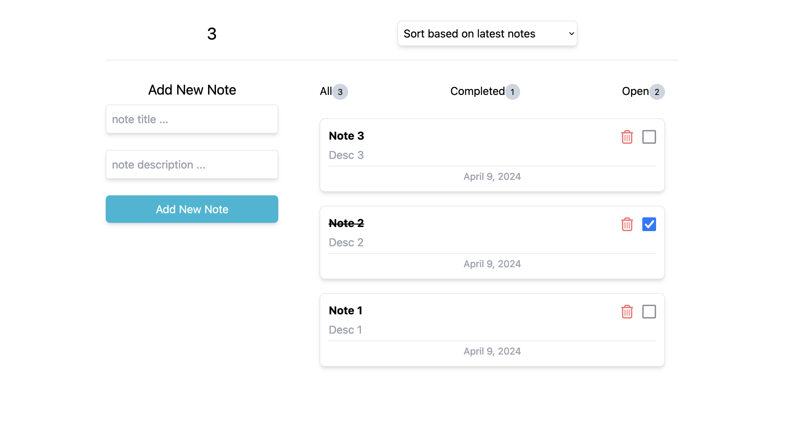

# Hi, I'm Ali! 👋

# Note App


this is a note app power by react. also we use TailwindCSS as a CSS framwork.

- [Feachers](#feachers)
- [Instalation](#installation)
- [Contributing](#contributing)
- [License](#license)
- [Contact](#contact)

## Feachers

- add a note
- sort by latest, earliest and completed
- remove a note
- checkbox to show if it's completed or not

## Installation

Install Note App with npm

```bash
  npm init
```

## contributing

Contributions are always welcome!

See `contributing.md` for ways to get started.

Please adhere to this project's `code of conduct`.

## License

[MIT](https://choosealicense.com/licenses/mit/)

## Contact

If you have any questions, suggestions, or just want to say hi, feel free to reach out:

- Email: aliarshaexcellent@gmail.com
- Twitter: [@ali_arshaa](https://twitter.com/ali_arshaa)
- GitHub: [github.com/aliarshaa](https://github.com/aliarshaa)
